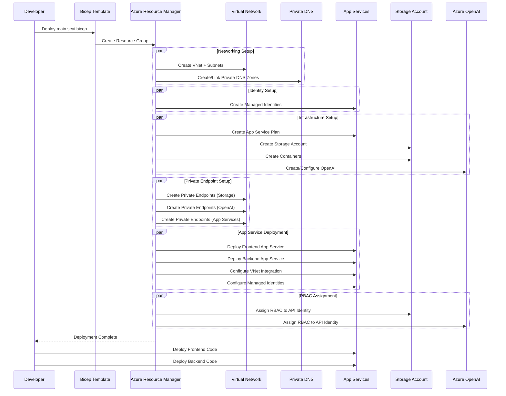

# SCAI Application Architecture

## Overview
The SCAI (Software Compliance AI) application is deployed with a secure, private network architecture using Azure services. All resources are deployed with private endpoints and VNet integration to ensure security and compliance.

## Architecture Diagram

```mermaid
graph TB
    subgraph "User Access"
        User[Users/Browsers]
    end

    subgraph "Azure Virtual Network (10.1.0.0/16)"
        subgraph GatewaySubnet["Gateway Subnet (10.1.1.0/26)"]
            PE_UI[Private Endpoint - UI]
            PE_API[Private Endpoint - API]
            PE_Storage[Private Endpoint - Storage]
            PE_OpenAI[Private Endpoint - OpenAI]
        end
        
        subgraph WebSubnet["Web Subnet (10.1.2.0/26)"]
            UI[Frontend App Service<br/>React/Vite<br/>Node.js 20<br/>Public Access: Enabled]
            API[Backend App Service<br/>FastAPI<br/>Python 3.11<br/>Public Access: Disabled]
        end
        
        subgraph ServicesSubnet["Services Subnet (10.1.3.0/26)"]
            Services[Reserved for<br/>Future Services]
        end
    end

    subgraph "Azure Services"
        subgraph "App Service Plan"
            ASP[App Service Plan<br/>Linux B2<br/>Capacity: 1]
        end
        
        subgraph "Storage Account"
            Storage[Storage Account<br/>Standard_LRS<br/>Private Access Only]
            Artifacts[artifacts container]
            Runs[runs container]
            SBOMs[sboms container]
            Scans[scans container]
        end
        
        subgraph "Azure OpenAI"
            OpenAI[Azure OpenAI<br/>GPT-4o Deployment<br/>80K TPM<br/>Private Access Only]
        end
        
        subgraph "Identity & Access"
            UMI_UI[User-Assigned<br/>Managed Identity<br/>UI]
            UMI_API[User-Assigned<br/>Managed Identity<br/>API]
        end
    end

    subgraph "Private DNS Zones (Managed by SCAI)"
        DNS_Web[privatelink.azurewebsites.us]
        DNS_Blob[privatelink.blob.core.usgovcloudapi.net]
        DNS_Queue[privatelink.queue.core.usgovcloudapi.net]
        DNS_File[privatelink.file.core.usgovcloudapi.net]
        DNS_Table[privatelink.table.core.usgovcloudapi.net]
        DNS_OpenAI[privatelink.openai.azure.us]
    end

    subgraph "Optional Hub VNet"
        HubVNet[Hub VNet<br/>Optional Peering<br/>for Network Management]
    end

    %% User connections
    User -->|HTTPS| UI
    User -.->|Blocked| API

    %% App Service Plan relationship
    ASP -->|Hosts| UI
    ASP -->|Hosts| API

    %% VNet Integration
    UI -.->|VNet Integration| WebSubnet
    API -.->|VNet Integration| WebSubnet

    %% Private Endpoint Connections
    PE_UI -.->|Private Link| UI
    PE_API -.->|Private Link| API
    PE_Storage -.->|Private Link| Storage
    PE_OpenAI -.->|Private Link| OpenAI

    %% App to Services
    API -->|Managed Identity| Storage
    API -->|Managed Identity| OpenAI
    UI -->|API Calls| API

    %% Storage containers
    Storage -->|Contains| Artifacts
    Storage -->|Contains| Runs
    Storage -->|Contains| SBOMs
    Storage -->|Contains| Scans

    %% Managed Identities
    UI -.->|Uses| UMI_UI
    API -.->|Uses| UMI_API
    UMI_API -->|RBAC Roles| Storage
    UMI_API -->|RBAC Roles| OpenAI

    %% Private DNS
    PE_UI -.->|Resolves via| DNS_Web
    PE_API -.->|Resolves via| DNS_Web
    PE_Storage -.->|Resolves via| DNS_Blob
    PE_Storage -.->|Resolves via| DNS_Queue
    PE_Storage -.->|Resolves via| DNS_File
    PE_Storage -.->|Resolves via| DNS_Table
    PE_OpenAI -.->|Resolves via| DNS_OpenAI

    %% Optional Hub VNet Peering
    GatewaySubnet -.->|Optional Peering| HubVNet
    
    %% Private DNS Zones linked to SCAI VNet
    DNS_Web -.->|Linked to VNet| GatewaySubnet
    DNS_Blob -.->|Linked to VNet| GatewaySubnet
    DNS_OpenAI -.->|Linked to VNet| GatewaySubnet

    style UI fill:#4CAF50
    style API fill:#2196F3
    style Storage fill:#FF9800
    style OpenAI fill:#9C27B0
    style UMI_UI fill:#00BCD4
    style UMI_API fill:#00BCD4
```



## Component Details

### Frontend Application
- **Technology**: React + Vite, Node.js 20
- **Hosting**: Azure App Service (Linux)
- **Access**: Public HTTPS access enabled
- **VNet Integration**: Connected to Web subnet for outbound traffic
- **Private Endpoint**: Inbound traffic via private endpoint in Gateway subnet
- **Identity**: User-Assigned Managed Identity

### Backend API
- **Technology**: FastAPI, Python 3.11
- **Hosting**: Azure App Service (Linux)
- **Access**: Public access **disabled** (private only)
- **VNet Integration**: Connected to Web subnet
- **Private Endpoint**: All access via private endpoint in Gateway subnet
- **Identity**: User-Assigned Managed Identity with RBAC roles

### Storage Account
- **Type**: StorageV2, Standard_LRS
- **Access**: Private endpoints only (public access disabled)
- **Containers**:
  - `artifacts` - General artifact storage
  - `runs` - Run manifests and metadata
  - `sboms` - Software Bill of Materials files
  - `scans` - Trivy security scan results
- **Private Endpoints**: Separate endpoints for blob, queue, file, and table services
- **Authentication**: Managed Identity with RBAC (no shared keys)

### Azure OpenAI
- **Model**: GPT-4o (2024-11-20)
- **Capacity**: 80,000 Tokens Per Minute (TPM)
- **Access**: Private endpoint only (public access disabled)
- **API Version**: 2024-10-21
- **Authentication**: Managed Identity (API key authentication disabled)

### Networking

#### Virtual Network Structure
```
VNet: 10.1.0.0/16
├── Gateway Subnet: 10.1.1.0/26
│   └── Private Endpoints for all services
├── Web Subnet: 10.1.2.0/26
│   ├── Delegated to Microsoft.Web/serverFarms
│   └── VNet-integrated App Services
└── Services Subnet: 10.1.3.0/26
    └── Reserved for future services
```

#### Private DNS Zones
SCAI creates and manages its own private DNS zones for name resolution:
- App Services: `privatelink.azurewebsites.us`
- Storage (Blob): `privatelink.blob.core.usgovcloudapi.net`
- Storage (Queue): `privatelink.queue.core.usgovcloudapi.net`
- Storage (File): `privatelink.file.core.usgovcloudapi.net`
- Storage (Table): `privatelink.table.core.usgovcloudapi.net`
- OpenAI: `privatelink.openai.azure.us`

These DNS zones are linked to the SCAI VNet and are not shared with other spokes.

### Security Features

#### Network Security
- ✅ All backend resources have public access disabled
- ✅ Private endpoints for all Azure services
- ✅ VNet integration for App Services
- ✅ Route all traffic through VNet (`vnetRouteAllEnabled`)
- ✅ Network Security Groups (NSG) applied to all subnets
- ✅ TLS 1.3 minimum for App Services
- ✅ HTTPS only enforced

#### Identity & Access Management
- ✅ Managed Identities (no credentials in code)
- ✅ RBAC role assignments:
  - **Storage Blob Data Contributor** - API can read/write blobs
  - **Storage Blob Data Owner** - API has full blob control
  - **Storage Queue Data Contributor** - API can manage queues
  - **Cognitive Services OpenAI Contributor** - API can manage OpenAI
  - **Cognitive Services OpenAI User** - API can use OpenAI
- ✅ Key Vault integration ready (for future secrets)
- ✅ No shared access keys for storage

#### Data Security
- ✅ Encryption in transit (HTTPS/TLS)
- ✅ Encryption at rest (Azure default)
- ✅ No public blob access
- ✅ Private endpoints for all data services

### Environment Configuration

#### Backend Environment Variables
```bash
# Identity
AZURE_CLIENT_ID=<umi-api-client-id>

# Storage
AZURE_STORAGE_ACCOUNT_NAME=<storage-account-name>
AZURE_STORAGE_ENDPOINT_SUFFIX=core.usgovcloudapi.net

# Azure OpenAI
OPENAI_API_BASE=<openai-endpoint>
OPENAI_API_VERSION=2024-10-21
OPENAI_MODEL_NAME=gpt-4o
OPENAI_ENDPOINT=<openai-endpoint>
AZURE_OPENAI_ENDPOINT=<openai-endpoint>
AZURE_OPENAI_DEPLOYMENT=gpt-4o

# Deployment
SCM_DO_BUILD_DURING_DEPLOYMENT=true
```

#### Frontend Environment Variables
```bash
# API Configuration
VITE_API_URL=https://<backend-app-name>.azurewebsites.us

# Deployment
SCM_DO_BUILD_DURING_DEPLOYMENT=true
```

### Deployment Workflow



## Data Flow

### User Interaction Flow
1. User accesses Frontend UI via public HTTPS endpoint
2. Frontend authenticates user (future: Azure AD integration)
3. Frontend makes API calls to Backend via private endpoint
4. Backend authenticates request using Managed Identity
5. Backend retrieves/stores data in Storage using Managed Identity
6. Backend calls Azure OpenAI for AI assistance using Managed Identity
7. Results returned to Frontend and displayed to user

### Backend API Processing Flow
```
User Request → Frontend → Private Endpoint → Backend API
                                               ↓
                                    [Managed Identity Auth]
                                               ↓
                          ┌────────────────────┴───────────────────┐
                          ↓                                        ↓
                    Azure Storage                           Azure OpenAI
                          ↓                                        ↓
                [Store/Retrieve Files]                    [AI Processing]
                 - SBOMs                                  - GPT-4o
                 - Scan Results                           - Embeddings
                 - Run Metadata                           - Completions
                 - Artifacts                                   
                          ↓                                        ↓
                          └────────────────────┬───────────────────┘
                                               ↓
                                      Backend Response
                                               ↓
                                          Frontend
                                               ↓
                                             User
```

## Future Enhancements

### Phase 2 - Authentication & Authorization
- [ ] Azure AD integration for Frontend
- [ ] API authentication with bearer tokens
- [ ] Role-based access control (RBAC) for users
- [ ] Multi-factor authentication (MFA)

### Phase 3 - Monitoring & Observability
- [ ] Application Insights integration
- [ ] Log Analytics workspace
- [ ] Custom metrics and alerts
- [ ] Distributed tracing

### Phase 4 - Advanced Networking
- [ ] Application Gateway with WAF
- [ ] Azure Firewall integration
- [ ] DDoS protection
- [ ] Custom domain with SSL certificates

### Phase 5 - High Availability & DR
- [ ] Multi-region deployment
- [ ] Traffic Manager or Front Door
- [ ] Geo-redundant storage
- [ ] Automated backup and restore

### Phase 6 - Data & Integration
- [ ] Azure SQL Database for structured data
- [ ] Cosmos DB for document storage
- [ ] Service Bus for async messaging
- [ ] Event Grid for event-driven architecture

## Cost Optimization

### Current Monthly Cost Estimate (USD)
| Service | SKU | Estimated Cost |
|---------|-----|----------------|
| App Service Plan | B2 Linux | ~$70 |
| Storage Account | Standard_LRS | ~$5 |
| Azure OpenAI | GPT-4o 80K TPM | ~$400-800* |
| VNet & Private Endpoints | Standard | ~$30 |
| **Total** | | **~$505-905/month** |

*Cost depends on actual usage (tokens processed)

### Cost Saving Recommendations
1. Use B1 tier for Dev/Test environments (~$13/month)
2. Implement caching to reduce OpenAI API calls
3. Use spot instances for non-production workloads
4. Configure auto-scaling based on actual load
5. Review and clean up unused storage containers

## Operational Considerations

### Deployment
- Infrastructure as Code (Bicep templates)
- Parameterized for multiple environments (DEV, UAT, PROD)
- Azure DevOps or GitHub Actions compatible
- Automated RBAC role assignments

### Monitoring
- Resource health checks via Azure Portal
- Storage metrics for capacity planning
- OpenAI rate limiting and throttling monitoring
- App Service diagnostics and logging

### Backup & Recovery
- Storage account soft delete enabled
- Point-in-time restore for blobs
- Deployment templates in source control
- Disaster recovery plan documented

### Compliance
- All resources in Azure Government Cloud
- Private endpoints ensure data doesn't traverse internet
- Managed Identity removes credential management
- Audit logs via Azure Activity Log
- Ready for FedRAMP compliance requirements

## References

- [Azure App Service Documentation](https://learn.microsoft.com/azure/app-service/)
- [Azure OpenAI Service Documentation](https://learn.microsoft.com/azure/ai-services/openai/)
- [Azure Private Link Documentation](https://learn.microsoft.com/azure/private-link/)
- [Azure Storage Documentation](https://learn.microsoft.com/azure/storage/)
- [Managed Identities Documentation](https://learn.microsoft.com/azure/active-directory/managed-identities-azure-resources/)
